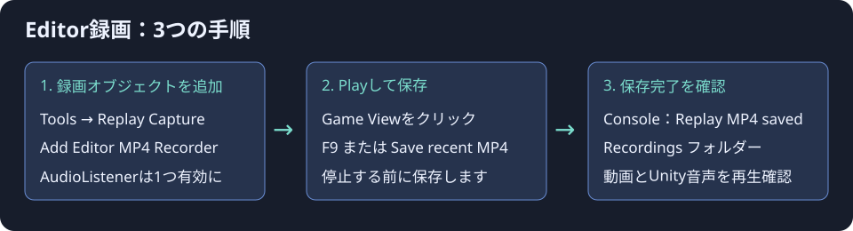

# Replay Capture for Windows Editor 1.0.1

Unity EditorのPlay中に、直近のゲーム画面とUnity音声をMP4へ保存します。Windows x64／Unity 6000.3.23f1で検証しました。

## 導入（3ステップ）

1. Unityの **Assets > Import Package > Custom Package** から本unitypackageを読み込みます。
2. **Tools > Replay Capture > Add Editor MP4 Recorder** を選びます。有効な **AudioListenerを1つ**、Main Cameraなどに置いてください。
3. **Play** を押し、**Game ViewをクリックしてF9**。またはRecorderのInspectorで **Save recent MP4 (F9)** を押します。

既定の保存先はプロジェクト直下の **Recordings** フォルダーです。Consoleの `Replay MP4 saved:` が完了通知です。Playを止める前に保存してください。正常停止すると、このセッションの一時動画のみが削除されます。

## 設定

| 設定 | 既定値 | 内容 |
|---|---:|---|
| Seconds | 900 | 最大15分の保持設定 |
| Width / Height | 1920 / 1080 | Game View全体をこの解像度へ縮小 |
| Frames Per Second | 60 | MP4の出力fps |
| Bitrate Megabits | 16 | 映像の目標ビットレート（Mbps） |
| Segment Seconds | 5 | 一時動画を区切る秒数 |
| Cache Megabytes | 4096 | 一時領域の容量予算 |
| Output Directory | 空欄 | 空欄ならプロジェクト直下のRecordings |

設定変更は録画を停止してから行ってください。旧 `ReplayRecorder`（AVI方式）との同時使用は避けてください。

### 1.0.1の修正

停止直後の再開始や、未使用の `ReplayListenerTap` がAudioListenerに残っている場合も録画を開始できます。別のRecorderが実際に録画中の場合は、二重録画を防ぐため開始を拒否します。そのRecorderを停止してから開始してください。

## 診断画面

**Tools > Replay Capture > Diagnostics** で、取得形式、保持秒数、キャッシュ量、重複・取りこぼし、音声不足、保存先を確認できます。任意のRenderTextureのプレビューとPNG書き出しもできます。

新方式はGPUでNV12に変換し、データ量を減らして非同期読み戻しします。圧縮とファイル処理は別スレッドです。保存中も録画は続き、同時に実行できる保存は1件です。

## 制約

- **Editor専用**です。ゲームのビルド版で録画する機能ではありません。
- **15分設定の実時間検証は、ユーザー指定により省略しました。65秒の連続録画を検証しています。** 詳細はVALIDATION.mdを参照してください。
- 描画不足時は直前の映像で補完します。60 fpsのファイルでも、毎秒60枚の異なる画面を保証するものではありません。負荷ゼロにもなりません。
- 音声はUnityのAudioListenerを通るMono/Stereo、44100/48000 Hz。OSの他アプリ音声は収録しません。Unityに取り込んだマイク等はUnity音声の一部として含まれます。
- 保持時間は区間単位・容量制限により短くなることがあります。16 Mbpsの15分映像は約1.8 GB。加えて一時PCM音声は約173 MB、保存時の完成MP4領域が必要です。
- 一時ファイルは `Library/ReplayCapture/<セッションID>`。正常停止時に自分のセッション分だけ削除し、異常時には調査用に残します。
- 再コンパイルは録画セッションの切り替えになります。AudioListenerの破棄、音声デバイス変更時は録画を再開始してください。
- ComputeShader非対応時はBGRA読み戻しへフォールバックします。WindowsのMedia Foundation／H.264・AACエンコーダーが必要です。ハードウェアエンコードの実使用は保証しません。

## コードから保存

`EditorDiskReplayRecorder.SaveRecentVideo()`、または完了を待つ `SaveRecentVideoAsync()` を使えます。Windows Editor限定のクラスなので、呼び出し元も `#if UNITY_EDITOR_WIN` で囲んでください。

## 同梱物

- Runtime / Editor：録画、音声、循環管理、診断UIのC#ソース
- Resources：独自実装のGPU色変換ComputeShader
- Plugins/Editor/x86_64：独自実装のWindowsネイティブDLL（Editor限定）
- NativeSource：同DLLの完全なC++ソースと再ビルド用PowerShell
- Documentation：この手順、検証結果、使用API・権利情報

新Input Systemを使う場合はそのUnity公式パッケージをプロジェクト側に用意してください。旧Input Managerにも対応するため、このパッケージのためだけにInput Systemを追加する必要はありません。

外部録画ライブラリ、FFmpeg、外部コーデックDLLは同梱していません。Windows標準APIを利用します。詳細はDEPENDENCIES.mdを参照してください。

ネイティブDLLを変更する場合はUnityを終了し、`Assets/ReplayCapture/NativeSource/build-native.ps1` を実行します。Visual Studio C++ツールセットとWindows SDKが必要です。`.cpp.txt` は配布用の拡張子で、スクリプトがC++としてコンパイルします。
